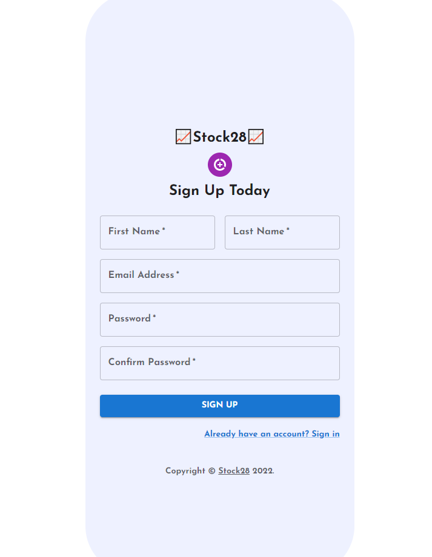

# Stock28 - Portfolio Tracker with a Collaborative User Experience

Stock28 is an app that fetches you day-to-day stock data on request. Our app boasts a slew of financial data that is geared towards makin your portfolio the most profitable it can be.

Compare real-time company data with others in your portfolio. Look up the most recent stock data and see its price charted out by time! 

Add other users to compare portfolios and optimize yours!

Try it out for yourself today: https://stock28.netlify.app/

[Stack: React.js, Ruby on Rails, PostgreSQL]
[Libraries: Redux, JWToken Authentication, Chart.js, React Router, bcrypt]

## User Authentication - Sign Up Today!

    

Storing sensitive user data in a secure PostgreSQL database, we also use bcrypt hashing to protect user passwords as well as set an expiration date for the issued JWToken to minimize any potential risk.

Rest assured, your portfolio is safe with us.

## Stock28 Homepage - Geared Towards You

