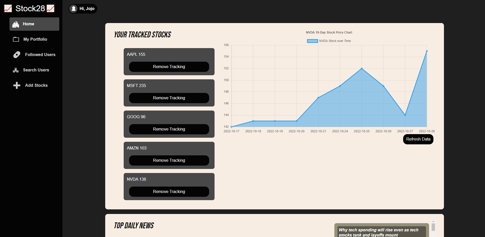
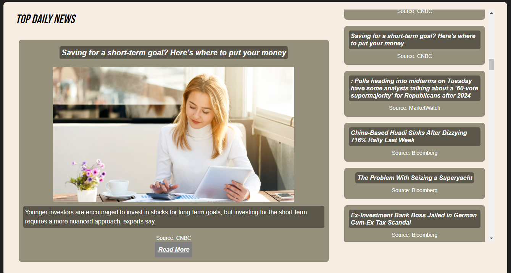
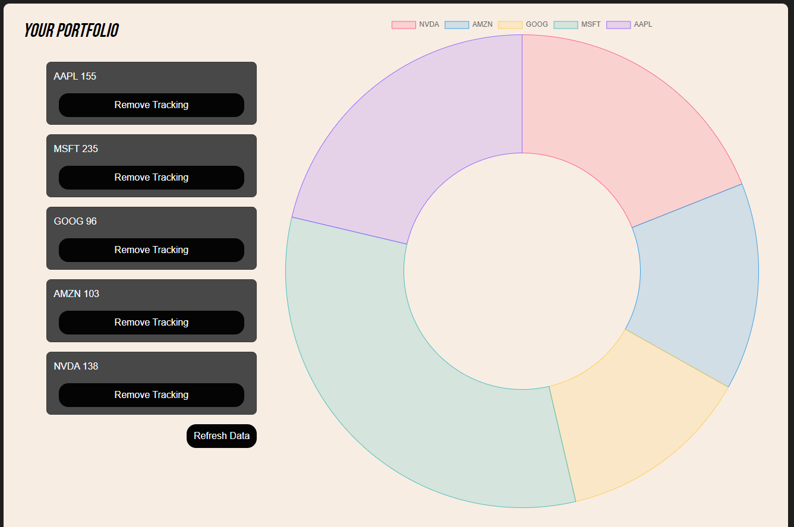
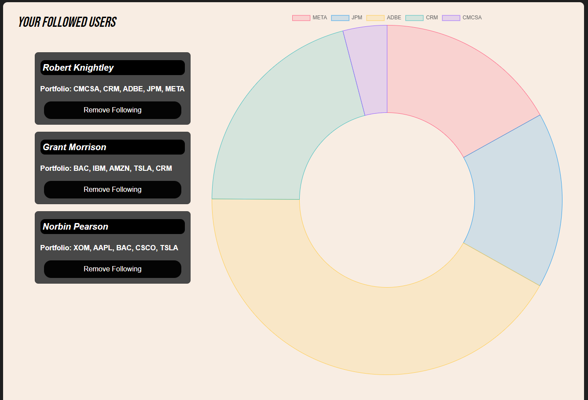
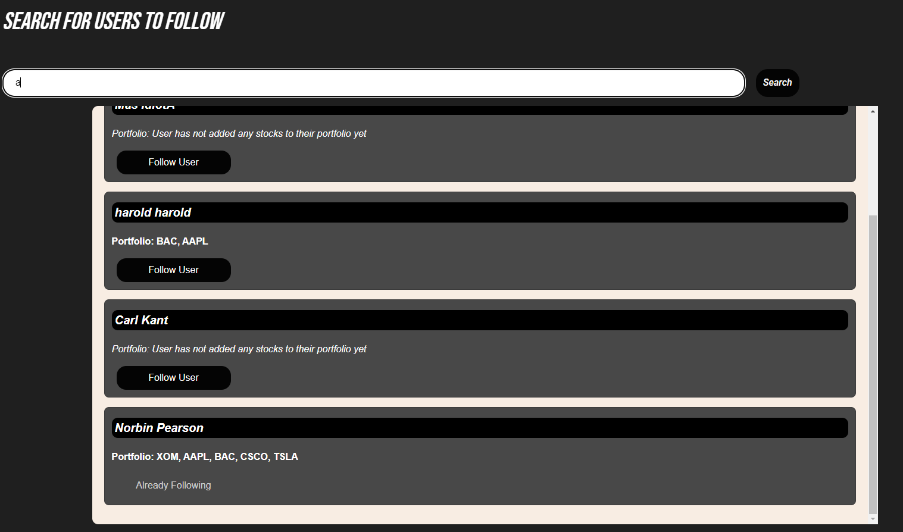
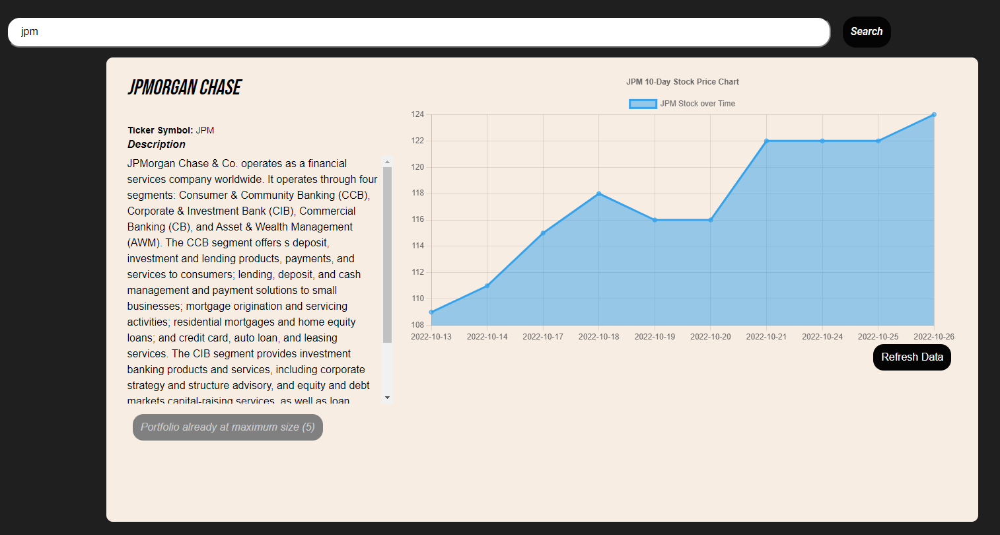

# Stock28 - Portfolio Tracker with a Collaborative User Experience

Stock28 is an app that fetches you day-to-day stock data on request. Our app boasts a slew of financial data that is geared towards makin your portfolio the most profitable it can be.

Compare real-time company data with others in your portfolio. Look up the most recent stock data and see its price charted out by time! 

Add other users to compare portfolios and optimize yours!

Try it out for yourself today: https://stock28.netlify.app/

[<strong><em>Stack:</em></strong> React.js, Ruby on Rails, PostgreSQL]

[<strong><em>Libraries:</em></strong> Redux, JWToken Authentication, Chart.js, React Router, bcrypt]

[<strong><em>Integrated APIs:</em></strong> Tiingo, Finnhub]

## User Authentication - Sign Up Today!

    

Storing sensitive user data in a secure PostgreSQL database, we also use bcrypt hashing to protect user passwords as well as set an expiration date for the issued JWToken to minimize any potential risk.

Rest assured, your portfolio is safe with us.

## Stock28 Homepage - Geared Towards You

    

Once logged in, you'll see a homepage that is customized for you. You'll see your day-to-day portfolio performance and can click on different stocks in your portfolio to view their 10-day performance reflected in the chart. You can also click "Refresh Data" to get the latest data.

Take a look the sidebar menu's content to explore all the robust features that Stock28 has to offer!

    

And finally on the homepage, there is a news section that has curated featured news articles about the world's business, tech, and natural resources industries to better inform and all future investments. Make the most of your time with us at Stock28!

## Portfolio Breakdown

    

See the breakdown of your portfolio's stocks rendered beautifully onto the screen! Clicking on the "My Portfolio" option in the side menu renders an interactive data visualization of your portfolio.

You can remove a stock from your portfolio at any time, including on the homepage, and all our graphs and data visualizations with dynamically update alongside your real-time financial decisions!

## Follow Other Stock28 User Portfolios and Adding Followings

    

Navigate to the "Followed Users" option in the side menu to see an aggregation of all users that you have followed. Click on their names to dynamically render their portfolio breakdowns onto the doughnut chart and compare your performances to theirs.

Stock28 boasts a collborative investing experience!

As for adding users, please see below:

    

Our search function is allows our users to look up other users and see the results rendered onto the screen. It will also tell you if you are already following them and disable the option to follow them again.

Furthermore, a preview of the other users' portfolio will be shown, helping inform you whether or not you want to follow them based on their stocks.

The Stock28 community only continues to grow in collaboration!

## Adding Stocks

    

Finally, navigating to "Add Stocks" in the side meny will allow users to search for stocks by ticker symbol and render all company information, along with an up-to-date chart of stock information onto the screen.

Like the homepage and portfolio page, the user can click "Refresh Data" <em>at any time</em> to request, receive, and dynamically render real-time stock data to help our users make the <strong>best</strong> decision for their financial wellbeing.

This search function will also inform you if you have already added the stock to your portfolio.

## Final Overview

Stock28 is a flexible, robust, and collaborative investing experience. If you're a finance professional or a casual investor, feel free to join our app today!

### Developer Notes

Stock28 utilizes a personalized caching algorithm to reduce needless and excessive API calls